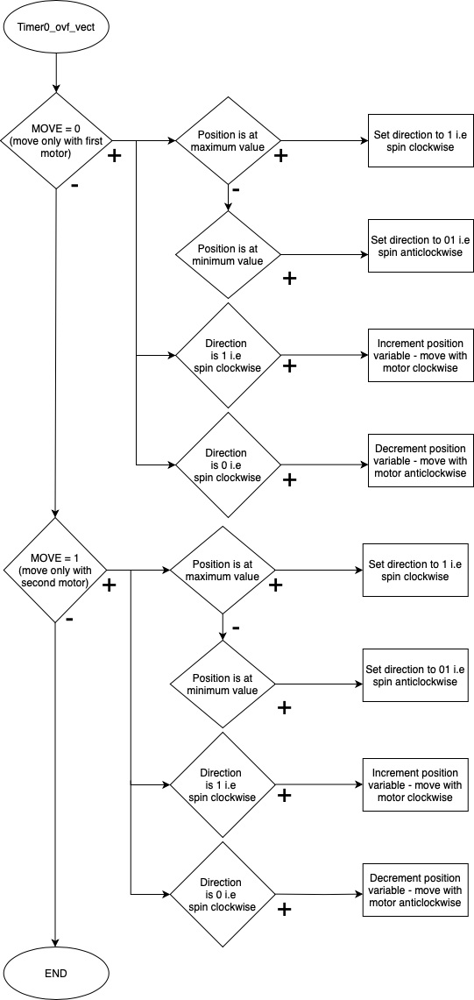
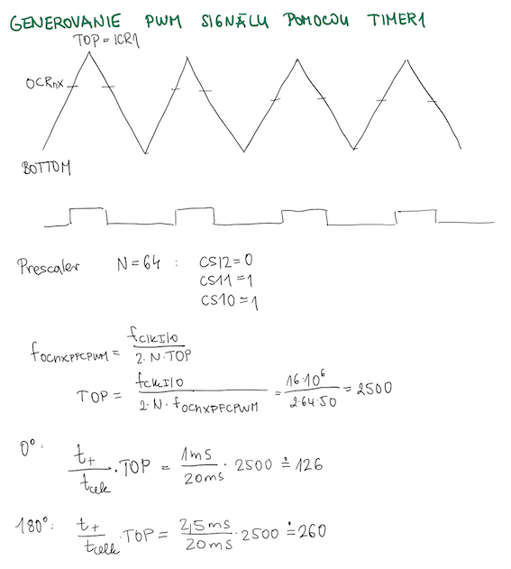

# Projekt 2

Generovanie PWM signálu. Aplikácia dvoch alebo viacerých Servo motorov SG90.

## Štruktúra projektu

   ```c
   YOUR_PROJECT        // PlatfomIO project
   ├── include         // Included files
   │   └── timer.h     // Include Interrupts
   ├── lib             // Libraries
   │   └── gpio        // Library for controlling GPIO pins
   │     └── gpio.h
   │     └── gpio.c                   
   ├── src             // Source file(s)
   │   └── main.c
   ├── platformio.ini  // Project Configuration File
   └── README.md       // Report of this project
   ```

## Členovia týmu

* Petra Slotová (zodpovedná za kód, schému a video)
* Natália Pločeková (zodpovedná za kód, schému a vývojové diagramy)

## Popis zapojenia hardvéru
### Prvý Servo motor SG90
* GND na GND
* V+ na +5V
* SIG na digitálný pin 9, ktorý generuje pwm signál

### Druhý Servo motor SG90
* GND na GND
* V+ na +5V
* SIG na digitálný pin 10, ktorý generuje pwm signál


Obr. 1 - Zapojenie v programe SimulIDE

## Popis softvéru
Odkaz na samotný kód je v tomto linku: [main.c](https://github.com/PlocekovaNat/DigitalElectronics2/blob/main/projekt2/Projekt2/src/main.c).

Pomocou prerušenia PCINT0_vect, ktoré reaguje na stlačenie pripojeného tlačidla meníme hodnotu parametru MOVE a tým určujeme, ktorý motor sa bude pohybovať.


Obr. 2 - Vývojový diagram pre prerušenie PCINT0_vect

Pomocou nastavenia registrov a prerušenia TIMER1_ovf_vect nastavujeme generovanie PWM signálu, ktorý ovláda motory Servo SG90. Pre generovanie bol podľa technického listu použitý 10. mód. Hornú hranicu PWM singálu určuje ICR1, ktorého hodnota pri 64-bitovéj preddeličke vychádza 2500. Vďaka tomuto nastaveniu má  vystupní signál 50 Hz. Střída generovaného signálu určuje, v akej polohe sa nachádza rameno motoru. Pomocou internetových článkov a následne empiricky boli určené hodnoty pre najnižšiu a najvyššiu polohu motora. Pre najnižšiu hodnotu t.j. 0° je potrebné, aby kladný impulz trval približne 1 ms, pre 90° 1,5ms a pre 180° je potrebný cca 2ms kladný impulz. Výpočty sú uvedené na priloženom obr. 4.



Obr. 3 - Vývojový diagram pre prerušenie PCINT0_vect



Obr. 4 - Výpočty hodnôt použitých pri nastavení generovania PWM signálu
## Video

https://www.youtube.com/watch?v=eWjvdO4YbTk

## References

1. [ATmega328P datasheet](https://ww1.microchip.com/downloads/aemDocuments/documents/MCU08/ProductDocuments/DataSheets/ATmega48A-PA-88A-PA-168A-PA-328-P-DS-DS40002061B.pdf)
2. https://lastminuteengineers.com/servo-motor-arduino-tutorial/
