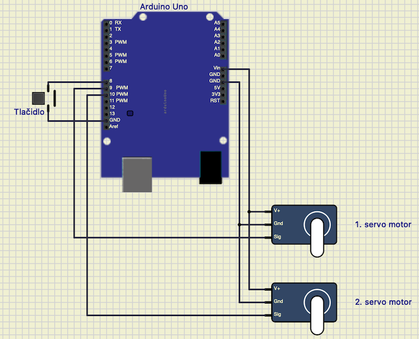
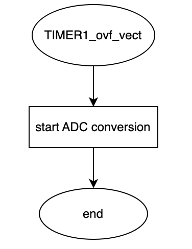
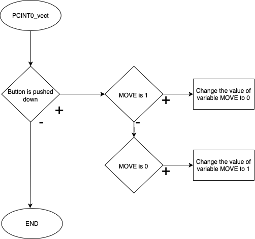
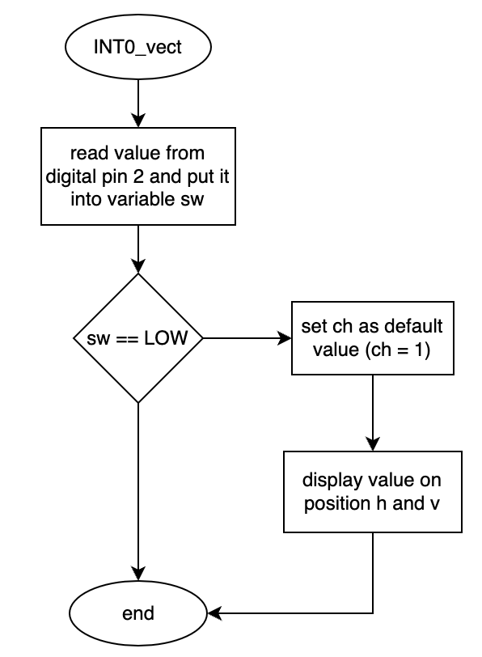
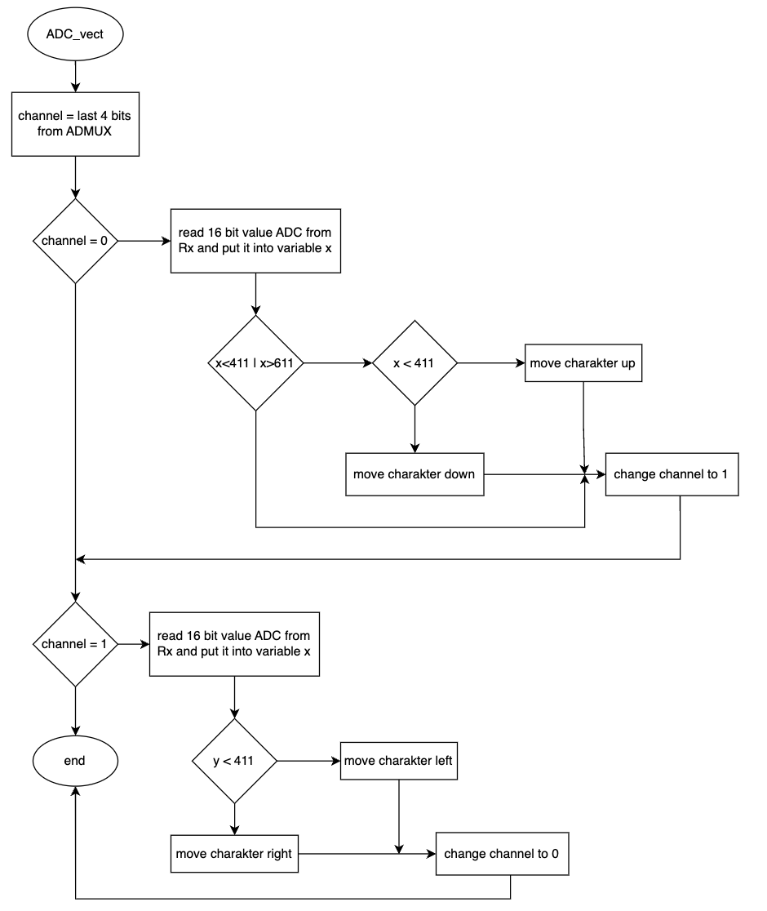

# Projekt 1

Applikácia analogového joy-sticku (2 ADC kanály, 1 tlačítko), rotačný enkóder, a Digilent PmodCLP LCD modul.

## Štruktúra projektu
   ```c
   PROJEKT1            				// PlatfomIO project
   ├── include         				// Included files
   │	└── timer.h
   ├── lib             				// Libraries
   │ 	└── gpio				// Library for controlling GPIO pins
   │		└── gpio.c
   │	 	└── gpio.h
   │	└── lcd				        // Library for communication with LCD display
   │		└── lcd.definitions.h
   │		└── lcd.c
   │		└── lcd.h
   ├── src             				// Source file(s)
   │   └── main.c
   ├── test            				// No need this
   ├── .gitignore
   ├── platformio.ini  				// Project Configuration File
   └── README.md       				// Report of this project
   ```

## Členovia týmu

* Natália Pločeková (zodpovedná za kód, schému, video)
* Petra Slotová (zodpovedná za kód, schému, vývojové diagramy)

## Popis zapojenia hardvéru

### Joystick
* GND na GND
* +5V na +5V
* VRx a VRy na analogové piny A0 a A1

### Rotačný enkóder
* GND na GND
* +5V na +5V
* CLK a DT na digitálne piny 11 a 12
* SW na digitálny pin 2

### Digilent PmodCLP LCD modul

pripojenie v simulátore SimulIDE
* RW sa pripojí na GND
* Rs a En na digitálne piny 8 a 9
* vstupné piny displeja D4 až D7  pripojíme na digitálne piny 4 až 7

pripojenie v reále
J1 - spodná polovica
* piny 7 až 10 pripojíme na digitálne piny 4 až 7
* GND na GND
* VCC na +5V
J2
* RW sa pripojí na GND
* Rs a En na digitálne piny 8 a 9


Obr. 1 - Zapojenie v programe SimulIDE


Obr. 2 - Zapojenie v reále

## Popis softvéru

* Pomocou prerušenia TIMER1_ovf_vect spúšťame každých 33 ms ADC konverziu.



Obr. 3 - Vývojový diagram pre prerušenie TIMER1_ovf_vect

* V prerušení PCINT0_vect si ako prvé vložime oneskorenie o 5 ms, aby sme sa vyhli zákmitom pri otáčaní enkóderom. 
Následne, ak je splnená nami definovaná podmienka pre ch, pri každom pootočení enkóderom zvyšujeme jej hodnotu a vypisujeme ju na displeji.



Obr. 4 - Vývojový diagram pre prerušenie PCINT0_vect

* Prerušenie INT0_vect využívame k stlačeniu tlačítka na enkóderi, kde hodnotu ch nastavíme na pôvodnú a zobrazíme ju na displeji.



Obr. 5 - Vývojový diagram pre prerušenie INT0_vect

* V poslednom prerušení sa venujeme joystiku, kde si do premennej channel načítame posledné 4 bity z ADMUXU, ktoré môžu nadobúdať hodnoty 0 alebo 1. Tým pádom rozlíšime, či chceme načítavať x-ovú alebo y-ovú os a pohybovať sa tak po displeji vpravo/vľavo alebo hore/dole. Pokiaľ sa náš znak dostane na koniec dispeja, zostane vďaka ďalším podmienkam na okraji a mimo displej sa už neposunie.



Obr. 6 - Vývojový diagram pre prerušenie ADC_vect

## Video

https://youtu.be/ypa0Erb12_o

## Zdroje

1. https://lastminuteengineers.com/rotary-encoder-arduino-tutorial/
2. https://www.c-sharpcorner.com/article/how-to-connect-arduino-joystick-in-arduino-uno/
